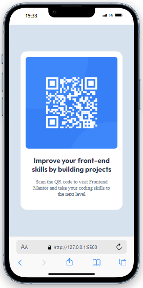

# Frontend Mentor - QR code Solução

Esta é uma solução para o [QR code component challenge on Frontend Mentor](https://www.frontendmentor.io/challenges/qr-code-component-iux_sIO_H). Frontend Mentor ajudam você a melhorar suas habilidades de codificação ao construir projetos realistas.

## Índice

- [Visão geral proposta](#visão-geral-proposta)
  - [Captura de tela do projeto feito](#captura-de-tela-do-projeto-feito)
  - [Links](#links)
- [Meu processo](#meu-processo)
  - [Construído Com](#construido-com)
- [Autor](#autor)

## Visão geral Proposta

### Captura de tela do projeto feito

### Links

- URL da solução: https://www.frontendmentor.io/challenges/qr-code-component-iux_sIO_H
- URL do Site ao Vivo: https://projeto-qr-code-o0vzf4st7-devedu7282s-projects.vercel.app

## Meu processo

### Construído com

- Semantic HTML5 markup
- CSS custom properties
- Flexbox
- CSS Grid

## Autor

- Website - ....
- Frontend Mentor - [@DevEdu7282] https://www.frontendmentor.io/profile/DevEdu7282